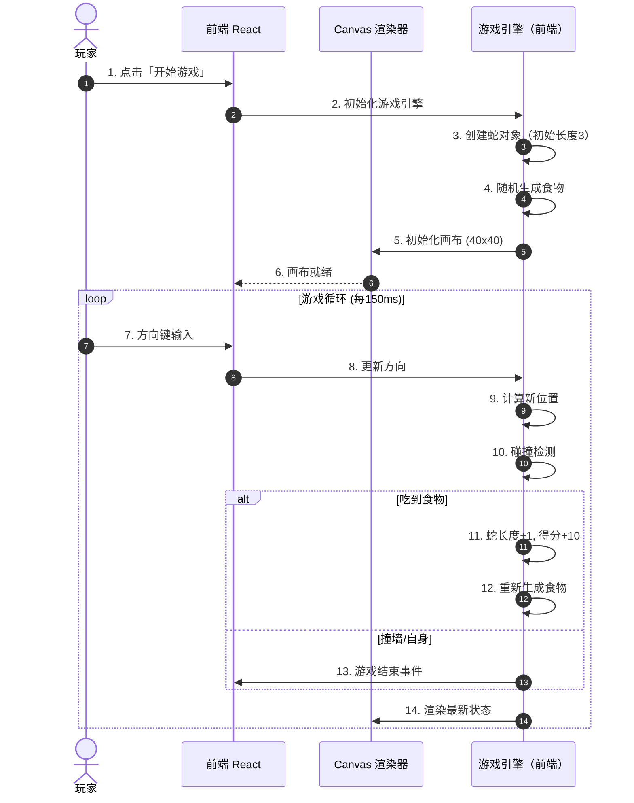
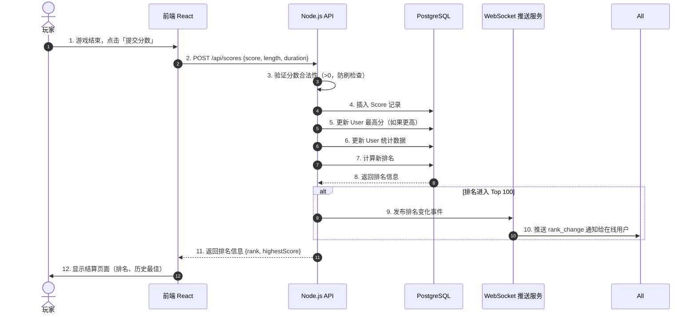
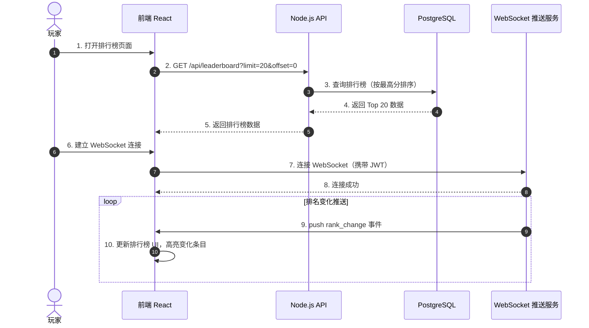
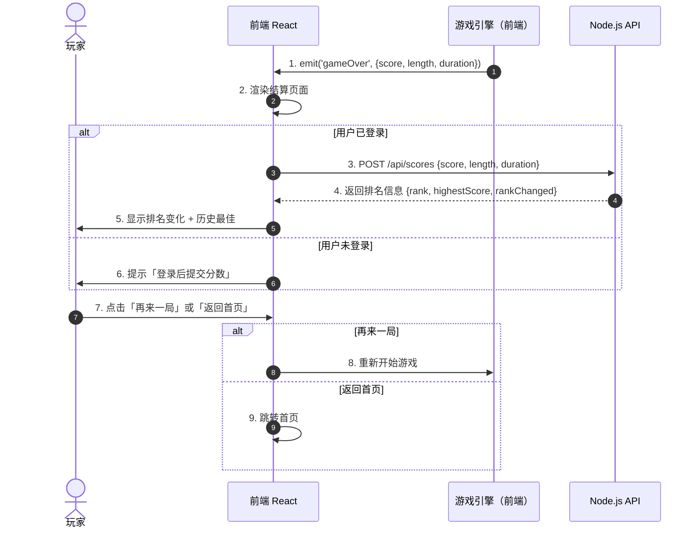

# PRD - 产品需求文档

**项目名称**: 贪吃蛇（单机 + 排行榜）  
**版本**: v1.0  
**创建日期**: 2026-04-20  
**最后更新**: 2026-04-20  
**负责人**: 小龙虾

---

## 1. 项目概述

### 1.1 项目背景

经典贪吃蛇游戏是广受欢迎的休闲游戏。本项目将贪吃蛇改造为**单机游玩 + 在线排行榜竞技**的混合模式：游戏本身完全在前端单机运行，无需网络同步；游戏结束后玩家可将分数提交到后端排行榜，与全球玩家比拼成绩。排行榜排名发生变化时，通过 WebSocket 向在线用户推送通知，营造竞技氛围。后端服务部署在群晖 NAS 的 Docker 容器中，实现轻量化、低成本的私有化部署。

### 1.2 核心定位

**游戏是单机的，排行榜是联网的。**

- 游戏运行不需要网络连接
- 排行榜查看、分数提交需要网络连接
- WebSocket 仅用于排行榜排名变更推送

### 1.3 项目目标

1. 实现经典单人贪吃蛇模式，流畅的单机游戏体验
2. 建立用户系统（注册、登录、个人资料）
3. 实现全局排行榜系统（按分数排序、我的排名、历史最佳）
4. 游戏结束后自动/手动提交分数到后端排行榜
5. WebSocket 推送排名变化通知给在线用户
6. 用户统计面板（总游戏次数、最高分、平均得分）
7. 游戏帧率稳定在 30 FPS 以上，页面加载 < 2s
8. WebSocket 推送延迟 < 500ms

### 1.4 项目范围

**包含**:
- 经典单人模式（本地游玩、离线可用）
- 用户系统（注册、登录、个人资料管理）
- 排行榜系统（全局排行、我的排名、历史最佳）
- 分数提交（游戏结束后提交到后端）
- 排名变化 WebSocket 推送通知
- 用户统计（总场次、最高分、平均分）
- 皮肤系统（蛇的外观自定义）
- 成就系统（达到特定分数解锁成就）
- 音效和动画

**不包含**:
- 多人对战 / 游戏房间
- 实时游戏同步
- 移动端原生 App（iOS/Android）
- 游戏内支付/虚拟货币系统
- AI 机器人对手

### 1.5 名词解释

| 名词 | 解释 |
|------|------|
| 单机游戏 | 完全在浏览器前端运行的游戏，无需网络连接 |
| 排行榜 | 存储所有玩家提交分数的全局排名系统 |
| 排名推送 | 当排行榜排名发生变化时，通过 WebSocket 向在线用户发送通知 |
| 历史最佳 | 用户个人所有游戏中的最高分记录 |
| 成就 | 达到特定条件（如首次破百、千分大师）解锁的徽章 |

---

## 2. 用户角色

### 2.1 角色列表

| 角色 | 描述 | 主要目标 |
|------|------|---------|
| 玩家 | 游戏的主要参与者 | 游玩游戏、获得高分、提升排行榜排名 |
| 访客 | 未登录用户 | 试玩经典模式、查看排行榜 |
| 管理员 | 系统后台管理者 | 查看运营数据、管理违规用户 |

### 2.2 用户画像

#### 角色 1: 玩家

- **基本信息**: 15-30 岁，学生或年轻职场人，休闲游戏爱好者
- **核心需求**: 流畅的游戏体验、公平的排名竞争、个人记录追踪
- **痛点**: 单机游戏缺乏社交性和竞技感；现有在线贪吃蛇游戏画质差
- **期望**: 响应速度快、画面精美、有成就感和排名竞争

#### 角色 2: 访客

- **基本信息**: 首次访问或不想注册的用户
- **核心需求**: 无需注册即可体验游戏核心玩法
- **痛点**: 强制注册流失用户体验
- **期望**: 先试玩，满意后再注册提交分数

---

## 3. 功能需求

### 3.1 功能清单

| 编号 | 功能名称 | 优先级 | 描述 |
|------|---------|--------|------|
| F-001 | 用户注册 | P0 | 通过邮箱/用户名注册账号 |
| F-002 | 用户登录 | P0 | 已注册用户登录系统 |
| F-003 | 个人资料管理 | P1 | 修改昵称、头像、查看统计 |
| F-004 | 经典模式 | P0 | 单人贪吃蛇游戏，本地游玩 |
| F-005 | 分数提交 | P0 | 游戏结束后提交分数到后端排行榜 |
| F-006 | 排行榜系统 | P0 | 全局排名、我的排名、历史最佳 |
| F-007 | 排名推送 | P1 | WebSocket 推送排名变化通知 |
| F-008 | 排行榜 UI | P1 | 实时刷新的排行榜组件 |
| F-009 | 用户统计 | P1 | 总游戏次数、最高分、平均得分 |
| F-010 | 皮肤系统 | P2 | 蛇的外观自定义 |
| F-011 | 成就系统 | P2 | 达到特定分数解锁成就 |
| F-012 | 音效和动画 | P2 | 游戏音效和视觉动画 |

### 3.2 功能详情

#### F-001: 用户注册

**描述**: 用户可以通过邮箱或用户名注册账号

**前置条件**: 用户未登录

**后置条件**: 创建用户账号，生成 JWT Token，自动登录

**业务流程**:
```
用户点击注册按钮
    ↓
填写用户名、邮箱、密码
    ↓
前端验证输入格式
    ↓
POST /api/auth/register 发送注册请求
    ↓
后端验证用户名唯一性、邮箱唯一性
    ↓
密码使用 bcrypt 哈希后存储
    ↓
创建用户记录，写入 PostgreSQL
    ↓
生成 JWT Token，返回给前端
    ↓
注册完成，跳转首页
```

**输入**:
| 字段 | 类型 | 必填 | 说明 |
|------|------|------|------|
| username | string | 是 | 3-16 字符，仅含字母、数字、下划线 |
| email | string | 是 | 有效的邮箱地址，全局唯一 |
| password | string | 是 | 8-32 位，包含字母和数字 |

**输出**:
- 成功：返回 JWT Token 和用户基本信息
- 失败：返回错误码和错误信息

**业务规则**:
1. 用户名全局唯一
2. 邮箱全局唯一
3. 密码复杂度：至少 8 位，包含字母和数字
4. 同一 IP 5 分钟内最多注册 3 次

---

#### F-002: 用户登录

**描述**: 已注册用户通过用户名/邮箱 + 密码登录

**前置条件**: 用户已注册

**业务流程**:
```
用户输入用户名/邮箱和密码
    ↓
POST /api/auth/login 发送登录请求
    ↓
后端查询用户，验证密码（bcrypt）
    ↓
密码正确：生成 JWT Token
    ↓
返回 Token 和用户信息
    ↓
前端存储 Token，跳转首页
```

**业务规则**:
1. 支持用户名或邮箱登录
2. 连续 5 次密码错误后锁定 15 分钟
3. JWT Token 有效期 24 小时
4. 同一账号最多 3 个活跃设备

---

#### F-004: 经典模式（单人游戏）

**描述**: 单人本地贪吃蛇游戏，无需网络连接

**业务流程**:
```
用户点击「开始游戏」
    ↓
加载游戏页面，初始化 Canvas 画布
    ↓
蛇从画布中心出发，初始长度 3
    ↓
用户通过方向键/ WASD 控制蛇的移动方向
    ↓
随机位置生成食物
    ↓
蛇吃到食物：长度 +1，得分 +10
    ↓
蛇撞到墙壁或自身：游戏结束
    ↓
显示最终得分，可选择重新游戏或提交分数
```

**游戏参数**:
| 参数 | 值 | 说明 |
|------|-----|------|
| 画布大小 | 40 x 40 格 | 每格 15px，总计 600 x 600 |
| 初始速度 | 150ms/步 | 每 150ms 移动一格 |
| 速度递增 | 每 50 分 -10ms | 最低 50ms/步 |
| 初始长度 | 3 格 | 蛇头 + 2 节蛇身 |
| 食物数量 | 1 个 | 同时存在 1 个食物 |

---

#### F-005: 分数提交

**描述**: 游戏结束后将分数提交到后端排行榜

**业务流程**:
```
游戏结束
    ↓
显示结算页面（得分、历史最佳、排名变化）
    ↓
if 用户已登录:
    ↓
    自动提交分数（或点击「提交分数」按钮）
    ↓
    POST /api/scores 提交分数
    ↓
    后端更新排行榜，检查排名变化
    ↓
    返回排名信息（当前排名、历史最佳）
    ↓
    向在线用户推送排名变化通知（WebSocket）
else:
    ↓
    提示「登录后提交分数」
    ↓
    跳转登录/注册页面
```

**提交数据**:
| 字段 | 类型 | 必填 | 说明 |
|------|------|------|------|
| score | number | 是 | 游戏得分 |
| length | number | 是 | 蛇最终长度 |
| duration_ms | number | 是 | 游戏时长（毫秒） |
| snake_skin | string | 否 | 使用的蛇皮肤 ID |

**业务规则**:
1. 每个用户每天最多提交 50 次分数（防刷）
2. 分数必须 > 0 才可提交
3. 提交后更新用户历史最高分（如果更高）
4. 提交后更新用户统计数据（总场次、平均分）

---

#### F-006: 排行榜系统

**描述**: 展示玩家排名，支持多种查看方式

**排行榜类型**:
| 类型 | 更新频率 | 说明 |
|------|---------|------|
| 全局排行 | 实时更新 | 按玩家历史最高分排序 |
| 我的排名 | 实时更新 | 当前用户在排行榜中的位置 |
| 历史最佳 | 个人维度 | 用户个人所有游戏中的最高分 |

**分页**: 每页 20 条，支持翻页

---

#### F-007: 排名推送

**描述**: 当排行榜排名发生变化时，通过 WebSocket 向所有在线用户推送通知

**推送场景**:
1. 用户提交新分数，排名进入 Top 100
2. 用户排名被其他玩家超越
3. 用户自己排名上升

**推送内容**:
```json
{
  "type": "rank_change",
  "userId": "xxx",
  "username": "PlayerA",
  "oldRank": 15,
  "newRank": 12,
  "score": 1250,
  "timestamp": 1713600000000
}
```

**业务规则**:
1. 仅向已登录且 WebSocket 连接的用户推送
2. 推送频率限制：同一用户 1 分钟内最多推送 3 次
3. 离线用户不推送（上线后可查询最新排名）
4. 仅排名进入 Top 100 的变化才推送

---

#### F-009: 用户统计

**描述**: 展示用户的游戏统计数据

**统计项**:
| 统计项 | 说明 |
|--------|------|
| 总游戏次数 | 用户提交分数的总次数 |
| 最高分 | 历史最高分 |
| 平均得分 | 所有提交分数的平均值 |
| 总游戏时长 | 累计游戏时间 |
| 当前排名 | 在排行榜中的位置 |
| 成就数量 | 已解锁的成就数量 |

---

## 4. 代码时序图

### 4.1 游戏启动与运行（单机）



### 4.2 分数提交流程



### 4.3 排行榜查看与实时更新



### 4.4 游戏结算流程



---

## 5. 非功能需求

### 5.1 性能要求

| 指标 | 要求 | 说明 |
|------|------|------|
| 页面加载 | < 2s | 首屏加载时间（首字节到渲染） |
| 游戏帧率 | >= 30 FPS | 客户端渲染帧率 |
| 排行榜刷新 | < 1s | 排行榜 API 响应时间 |
| WebSocket 推送 | < 500ms | 排名变化到客户端接收的时间 |
| API 响应 | < 200ms | REST API 95% 请求响应时间 |
| 分数提交 | < 500ms | 提交分数到收到确认的时间 |

### 5.2 安全要求

- 用户密码使用 bcrypt（cost factor 12）加密存储
- JWT Token 签名密钥使用环境变量，禁止硬编码
- 所有 REST API 进行身份验证（公开接口除外）
- 输入数据在服务端进行严格校验，防止作弊
- REST API 接口实施速率限制（登录接口：5 次/分钟；注册接口：3 次/5 分钟；分数提交：50 次/天/用户）
- 防止 XSS 攻击，用户生成内容需转义
- 防止 CSRF，关键 API 使用 Token 验证
- 分数提交防刷：校验游戏时长合理性（过短游戏视为作弊）

### 5.3 可用性要求

- 系统支持 7x24 小时运行
- Docker 容器崩溃后自动重启（restart: unless-stopped）
- 数据库每日自动备份
- 单点故障恢复时间 < 5 分钟
- 游戏单机运行，不受后端服务可用性影响

### 5.4 兼容性要求

| 平台 | 要求 |
|------|------|
| Chrome | 90+ |
| Firefox | 90+ |
| Safari | 14+ |
| Edge | 90+ |
| 分辨率 | 最低 1024 x 768 |

### 5.5 群晖 NAS 资源约束

| 资源 | 限制 | 说明 |
|------|------|------|
| CPU | 4 核 | Node.js 进程不超过 2 核 |
| 内存 | 2GB 容器上限 | PostgreSQL 1GB + Node.js 512MB + 余量 |
| 存储 | 10GB | 数据库 + 日志 + Docker 镜像 |

---

## 6. 技术架构

### 6.1 架构图

```
┌────────────────────────────────────────────────┐
│              群晖 NAS (Docker)                  │
│                                                │
│  ┌──────────────┐   ┌──────────────────────┐   │
│  │   Nginx      │   │  Node.js 20          │   │
│  │  静态文件    │──>│  Express API         │   │
│  │  反向代理    │   │  WebSocket 推送      │   │
│  │  端口: 80    │   │  端口: 3000          │   │
│  └──────┬───────┘   └────────┬─────────────┘   │
│         │                    │                 │
│         │                    ▼                 │
│         │           ┌──────────────────┐       │
│         │           │  PostgreSQL 15   │       │
│         │           │  端口: 5432      │       │
│         │           │  用户/分数数据   │       │
│         │           └──────────────────┘       │
│         │                                      │
│  ┌──────┴──────┐                               │
│  │  React 18   │ ← 构建后静态文件由 Nginx 托管  │
│  │  TypeScript │                               │
│  └─────────────┘                               │
└────────────────────────────────────────────────┘

群晖反向代理 (DSM 登录门户)
    │
    ├── HTTPS (443) ──> http://localhost:3000
    │    ├─ /        → express.static() 静态文件
    │    ├─ /api/*   → Node.js REST API
    │    └─ /ws      → WebSocket 升级
    │
    └── HTTP (80)   ──> 自动跳转 HTTPS

客户端浏览器
    │
    ├── 游戏运行 ──────────> 前端本地（无需网络）
    │    (Canvas 渲染)
    │
    ├── REST API ──────────> 群晖反向代理 -> Nginx -> Node.js
    │    (注册、登录、排行榜、分数提交)
    │
    └── WebSocket ─────────> Node.js
         (仅用于排行榜排名变更推送)
```

### 6.2 技术栈

| 层级 | 技术 | 版本 | 用途 |
|------|------|------|------|
| 前端 | React | 18.x | UI 框架 |
| 前端 | TypeScript | 5.x | 类型系统 |
| 前端 | Canvas API | 原生 | 游戏画布渲染 |
| 前端 | WebSocket (原生) | 原生 | 排行榜推送接收 |
| 前端 | Vite | 5.x | 构建工具 |
| 后端 | Node.js | 20.x | 运行时 |
| 后端 | Express | 4.x | REST API 框架 |
| 后端 | ws / Socket.io | 4.x | WebSocket 推送 |
| 后端 | bcrypt | 5.x | 密码哈希 |
| 后端 | jsonwebtoken | 9.x | JWT 认证 |
| 后端 | Zod | 3.x | 数据验证 |
| 数据库 | PostgreSQL | 15.x | 关系型数据库 |
| 数据库 | Prisma | 5.x | ORM |
| 部署 | Nginx | latest | 静态文件 + 反向代理 |
| 部署 | Docker Compose | latest | 容器编排 |

### 6.3 Docker Compose 配置

```yaml
version: '3.8'

services:
  nginx:
    image: nginx:alpine
    container_name: snake-nginx
    ports:
      - "3000:80"
    volumes:
      - ./nginx.conf:/etc/nginx/nginx.conf:ro
      - ./web/dist:/usr/share/nginx/html:ro
    depends_on:
      - server
    restart: unless-stopped

  server:
    build: ./server
    container_name: snake-server
    restart: unless-stopped
    environment:
      - NODE_ENV=production
      - DATABASE_URL=postgresql://${POSTGRES_USER:-snake}:${DB_PASSWORD}@db:5432/${POSTGRES_DB:-snake_game}
      - JWT_SECRET=${JWT_SECRET}
    depends_on:
      - db
    networks:
      - snake-net

  db:
    image: postgres:15-alpine
    container_name: snake-postgres
    environment:
      - POSTGRES_USER=${POSTGRES_USER:-snake}
      - POSTGRES_PASSWORD=${DB_PASSWORD}
      - POSTGRES_DB=${POSTGRES_DB:-snake_game}
    volumes:
      - snake_data:/var/lib/postgresql/data
      - ./database/init:/docker-entrypoint-initdb.d:ro
    restart: unless-stopped
    networks:
      - snake-net
    deploy:
      resources:
        limits:
          memory: 1G

volumes:
  snake_data:

networks:
  snake-net:
    driver: bridge
```

### 6.4 项目目录结构

```
snake-game/
├── docker-compose.yml   # 根目录，一键部署
├── nginx.conf           # Nginx 配置
├── server/              # 后端
├── web/                 # 前端源码
├── database/init/       # 数据库初始化
├── docs/                # 项目文档
└── scripts/             # 运维脚本
```
└── scripts/                    # 运维脚本
```

### 6.4 数据模型

```
User
├── id: UUID (PK)
├── username: string (unique, 3-16 chars)
├── email: string (unique)
├── password_hash: string
├── avatar_url: string (nullable)
├── highest_score: int (default 0)
├── total_games: int (default 0)
├── total_score: int (default 0)
├── total_duration_ms: int (default 0)
├── best_skin: string (nullable)
├── created_at: timestamp
└── updated_at: timestamp

Score
├── id: UUID (PK)
├── user_id: UUID (FK -> User)
├── score: int
├── snake_length: int
├── duration_ms: int
├── snake_skin: string (nullable)
├── created_at: timestamp

Achievement
├── id: UUID (PK)
├── user_id: UUID (FK -> User)
├── achievement_key: string (e.g., "first_100", "master_1000")
├── unlocked_at: timestamp
```

---

## 7. 接口设计

### 7.1 REST API 列表

| 方法 | 路径 | 认证 | 说明 |
|------|------|------|------|
| POST | /api/auth/register | 否 | 用户注册 |
| POST | /api/auth/login | 否 | 用户登录 |
| GET | /api/users/me | 是 | 获取当前用户信息 |
| PUT | /api/users/me | 是 | 更新用户资料 |
| GET | /api/users/:id/stats | 是 | 获取用户统计 |
| POST | /api/scores | 是 | 提交游戏分数 |
| GET | /api/leaderboard | 否 | 获取排行榜（分页） |
| GET | /api/leaderboard/me | 是 | 获取我的排名 |
| GET | /api/achievements | 是 | 获取我的成就列表 |
| GET | /api/achievements/all | 否 | 获取所有成就定义 |

### 7.2 WebSocket 事件

**仅用于排行榜排名变更推送**

#### 客户端 -> 服务器

| 事件 | 数据 | 说明 |
|------|------|------|
| connect | { token: string } | 建立连接（握手时认证） |
| ping | - | 心跳保活 |

#### 服务器 -> 客户端

| 事件 | 数据 | 说明 |
|------|------|------|
| rank_change | { userId, username, oldRank, newRank, score } | 排名变化通知 |
| pong | - | 心跳响应 |
| error | { code, message } | 错误信息 |

**rank_change 推送规则**:
- 仅当排名进入 Top 100 时推送
- 同一用户 1 分钟内最多接收 3 次推送
- 离线用户不推送

---

## 8. 风险评估

### 8.1 技术风险

| 风险 | 概率 | 影响 | 应对措施 |
|------|------|------|---------|
| 分数提交作弊 | 中 | 高 | 游戏时长合理性校验、提交频率限制、后端记录验证 |
| 群晖 NAS 性能不足 | 低 | 中 | 排行榜查询使用索引优化、分页限制、Redis 缓存 Top 100 |
| WebSocket 连接泄漏 | 低 | 中 | 心跳保活机制、超时自动断开、连接数限制 |
| 数据库写入瓶颈 | 低 | 中 | 分数写入使用批量处理、非关键路径异步 |

### 8.2 项目风险

| 风险 | 概率 | 影响 | 应对措施 |
|------|------|------|---------|
| 需求范围扩大 | 中 | 中 | 严格区分 P0/P1/P2 优先级，v1.0 只做核心功能 |
| 开发时间超期 | 中 | 中 | 任务拆分到 <=4 小时粒度，定期进度检查 |

---

## 9. 项目计划

### 9.1 里程碑

| 里程碑 | 预计日期 | 交付物 |
|--------|---------|--------|
| 需求确认 | 2026-04-20 | PRD 签字 |
| 原型确认 | 2026-04-21 | DRD + HTML 原型 |
| 任务规划 | 2026-04-21 | tasks.md + test-cases.md |
| 核心开发完成 | 2026-04-24 | 用户系统 + 游戏核心 + 分数提交 |
| 完整功能开发 | 2026-04-26 | 排行榜 + 推送 + 统计 |
| 测试完成 | 2026-04-28 | 测试报告 |
| 部署上线 | 2026-04-30 | 群晖 NAS Docker 部署 |

### 9.2 工时估算

| 阶段 | 工时 (小时) |
|------|------------|
| 需求分析 | 2 |
| 原型设计 | 3 |
| 任务规划 | 2 |
| 项目基础搭建 | 3 |
| 用户系统开发 | 6 |
| 游戏核心逻辑（前端） | 6 |
| 分数提交 + 排行榜 API | 4 |
| WebSocket 推送服务 | 3 |
| UI 页面与组件 | 8 |
| 皮肤与成就系统 | 4 |
| 音效与动画 | 2 |
| 测试与修复 | 5 |
| 部署配置 | 2 |
| **总计** | **50** |

---

## 10. 附录

### 10.1 参考资料

- Canvas API 文档: https://developer.mozilla.org/zh-CN/docs/Web/API/Canvas_API
- WebSocket API: https://developer.mozilla.org/zh-CN/docs/Web/API/WebSocket
- Express.js 文档: https://expressjs.com/

### 10.2 待定问题

| 问题 | 负责人 | 解决日期 |
|------|--------|---------|
| 是否需要支持移动端触屏操作 | 待讨论 | 2026-04-21 |
| 是否需要游戏回放功能 | 待讨论 | 2026-04-21 |
| 排行榜是否需要按时间段筛选（今日/本周/本月） | 待讨论 | 2026-04-21 |

---

## 确认签字

**PRD 版本**: v1.0  
**确认日期**: 2026-04-20

### 确认清单
- [ ] 需求是否完整？
- [ ] 功能是否满足业务？
- [ ] 架构设计是否合理？
- [ ] 技术选型是否恰当？
- [ ] 风险评估是否充分？

### 签字

**产品负责人**: ___________  **日期**: ___________

**技术负责人**: ___________  **日期**: ___________

**项目负责人**: ___________  **日期**: ___________

### 修改意见
{如有修改意见，详细列出}

---

**文档结束**
